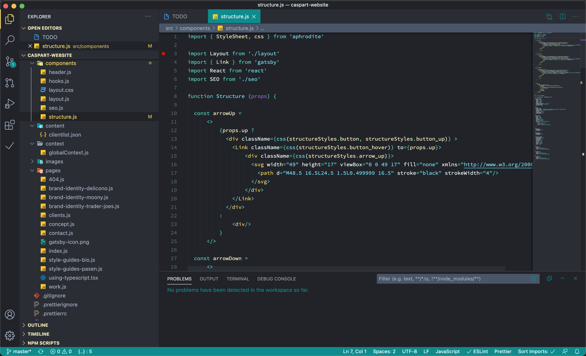
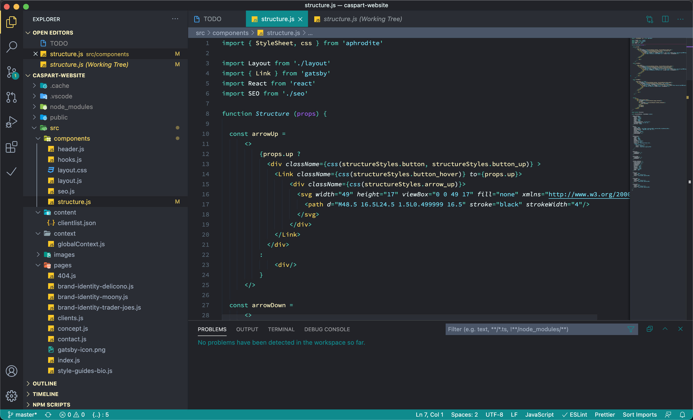

# Motion Haleness

A Visual Studio Code theme I decided to create for myself. And who knows.. Maybe you will like it too? 😎 I recently made the switch from atom to VS Code (*finally!) and was struggling to find the right colorscheme that truly fullfilled my colormatching desires. So I thought to myself: "why don't I make my own?" 👊 So this is the result thusfar and I'm quite happy with it. Ofcourse the theme is still fresh and some minor tweaks are expected. But feel free to test it out and give me some feedback, so we can polish this thing together!

## Motion Haleness

## Motion Haleness Italic

# Installation

1.  Install [Visual Studio Code](https://code.visualstudio.com/)
2.  Launch Visual Studio Code
3.  Choose **Extensions** from menu
4.  Search for `motion haleness`
5.  Click **Install** to install it
6.  Click **Reload** to reload the Code
7.  From the menu bar click: Code > Preferences > Color Theme > **Motion Haleness**

## Misc

I'm still a rookie at theme creation, so don't be shy to [file an issue](https://github.com/erole-attack/motion-haleness-vscode-theme/issues)! 😅 Suggestions are also very welcome!